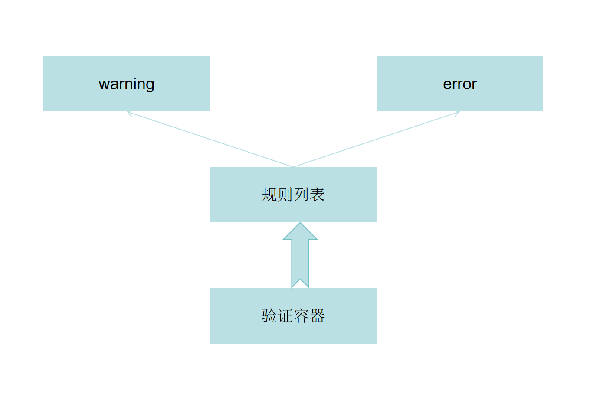

# 组合模式

## 目的
目标功能多变时，拆分功能以便重组适应多变的需求/功能。

## 场景
某个功能/组件有多种变化形式时，便可以利用重组模式来灵活组装功能/子组件来实现功能。一般将需求按照树状拆分。

## 示例代码

```javascript
function root(){}
function branch(){}
function leaf1(){}
function leaf2(){}
function leaf3(){}

// 组合1
root(
    branch(leaf1,leaf2)
)

// 组合2
root(
    branch(leaf1),
    branch(leaf2,leaf3),
)
```

### ElementUI 组合模式示例

```javascript
// 表单 - 伪代码
<el-form>
    <el-row>
        <el-col>
            <el-input>
            </el-input>
        </el-col>
        <el-col>
            <el-checkbox>
            </el-checkbox>
            <el-checkbox>
            </el-checkbox>
        </el-col>
    </el-row>

    <el-row>
        ...
    </el-row>

    ...
</el-form>
```

### 利用组合模式完成表单验证组件封装
1.把需求拆分成树状结构


2.代码实现
```javascript
function Validate(){
    this.list = []
    
}
Validate.prototype.addList = function(list){
    if(list instanceof ValiList){
        this.list = list.list
    } else {
        throw new Error('....')
    }
}

Validate.prototype.test = function(value){
    let validateResult = true
    for(let i; i< this.list.length; i++){
        this.list[i].run(value)
    }
}


function ValiList(){
    this.list = []
}

ValiList.prototype.addRule = function(rule){
    if(rule instanceof WarningRule || rule instanceof ErrorRule){
        this.list.push(rule)
    } else {
        throw new Error('...')
    }
}

function WarningRule(fn){
    this.fn = fn

}

WarningRule.prototype.run = function(value){
    const result = this.fn(value)
    if(result.succsess){
        return {
            result: true
        }
    } else {
        return {
            result: false,
            type: 'warning',
            mes: result.mes
        }
    }
}

function ErrorRule(fn){

}

ErrorRule.prototype.run = function(value){
    const result = this.fn(value)
    if(result.succsess){
        return {
            result: true
        }
    } else {
        return {
            result: false,
            type: 'error',
            mes: result.mes
        }
    }
}
// 工厂模式练习
function RuleFactory(type,fn){
    if(type === 'warning'){
        return new WarningRule(fn)
    } else if (type === 'error'){
        return new ErrorRule(fn)
    } else {
        throw new Error('type has to be warning or error.')
    }
}

const list = new ValiList()
const validate = new Validate()

list
    .addRule(RuleFactory('error',()=>{}))
    .addRule(RuleFactory('warning',()=>{}))
    .addRule(RuleFactory('warning',()=>{}))


validate.addlist()
validate.test()
```
内容来源为B站 三十的前端课